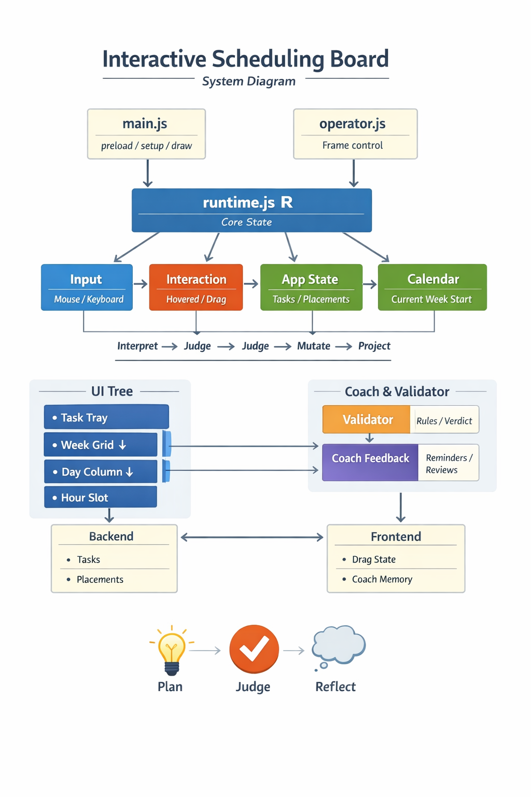

# Architecture — Interactive Scheduling Board

---

## 0. Runtime Glossary (Quick Reload)

### Core

* `R` → global runtime (everything flows through this)

### App State

* `R.appState.tasks` → task templates (reusable definitions)
* `R.appState.placements` → scheduled instances (`slotId → placement`)

### Domain

* `task` → template (name, default duration)
* `placement` → instance (`taskId`, `customDuration`)
* `slotId` → time key (`YYYY-MM-DD-HH`)

### Duration (CRITICAL)

* `effectiveDuration = placement.customDuration ?? task.duration`
* used everywhere (render, validation, drag)

### Time

* `R.calendar.currentWeekStart` → visible week anchor

### Input

* `R.input` → raw input (mouse, keyboard)

### Interaction

* `R.interaction.hovered` → current target
* `R.interaction.drag` → active drag session

### Drag Core

* `kind` → `"taskCard"` | `"placedTask"`
* `task`
* `fromSlotId`
* `customDuration`
* `_nearestSlot`
* `verdict`

### Validation

* `verdict = { ok, level, code, message }`

### UI Root

* `UI_ELEMENTS.planner` → root UI tree

### Feedback

* `R.toast` → UI feedback bridge

### Coach

* `localStorage["planner_coach_feedback_v1"]`
* keyed by `slotId`

---

## 1. System Identity

A **direct-manipulation scheduling system** with layered behavior:

1. **Plan** (place tasks)
2. **Judge** (validate placements)
3. **Reflect** (coach behavior)

---

## 2. Core Doctrine

* State is centralized (`R`)
* Mutation is controlled (`commands.js`)
* Rendering is projection (UI reads state)
* Validation is separate from mutation
* Coaching is separate from validation
* Every feature must have a clear landing layer

---

## 3. Runtime Flow

### Boot

`main.js → preload → setup → initState → loadState → initUI → READY`

### Frame Loop

`input → interaction → validator → command → state → render`

---

## 4. State Architecture

### `R.appState`

* `tasks` → templates
* `placements` → scheduled instances

### `R.calendar`

* `currentWeekStart` → visible time anchor

### `R.input`

* raw mouse / keyboard

### `R.interaction`

* `hovered`
* `drag` (session state)

### `R.transition`

* boot / loading / ready states

### `R.assets`

* fonts and shared assets

---

## 5. Module Ownership

### `main.js`

* p5 lifecycle (preload, setup, draw)

### `runtime.js`

* global runtime (`R`)

### `boot.js` / `loadState.js`

* state hydration from backend

### `operator.js`

* frame orchestration
* UI registry (`UI_ELEMENTS`)

### `routeInput.js`

* interprets interaction
* drag / click / context behavior

### `commands.js`

* all mutations
* backend sync

### `validator.js`

* placement rules
* returns verdict

### `coachFeedback.js`

* reminders
* review loop

---

## 6. UI Structure

### Root

* `Planner`

### Children

* `TaskTray`
* `WeekGrid`

  * `DayColumn`

    * `HourSlot`
* `ContextMenu`
* `Toaster`

---

## 7. Domain Model

### Task

* reusable template
* `{ id, name, duration, ... }`

### Placement

* scheduled instance
* `{ taskId, customDuration }`
* keyed by `slotId`

### Rule

* template ≠ instance

---

## 8. Duration Model

```
effectiveDuration = placement.customDuration ?? task.duration
```

Used by:

* rendering
* validation
* drag logic
* overflow detection

---

## 9. Interaction Model

### Task Drag

tray → drag → nearest slot → validate → place

### Placement Move

slot → drag → nearest slot → validate → move

### Context Menu

right-click → action → command

### Navigation

* prev / next / recenter week

---

## 10. Validation Layer

* runs before mutation
* outputs `verdict`

### Types

* ok
* warning
* error

### Examples

* overlap
* overflow
* heavy day

---

## 11. Coach Layer

### Live

* trigger when time enters slot

### Retro

* trigger when returning after missed slots

### Stores

* `startPrompted`
* `reviewed`
* `review`

---

## 12. Persistence Split

### Backend

* tasks
* placements
* customDuration

### Frontend

* interaction state
* drag session
* coach memory

---

## 13. Extension Rules

### Mutation

→ `commands.js`

### Rules

→ `validator.js`

### Reflection

→ `coachFeedback.js`

### UI

→ appropriate UI module

### Persistent Data

→ backend + sync

---

## 14. Entropy Hotspots

### `R.interaction.drag`

* risk: dumping ground for temp state

### `Planner.js`

* risk: becoming too smart

### `routeInput.js`

* risk: branching complexity

### Task vs Placement

* risk: mixing template and instance logic

---

## 15. Architecture Sentence

**State is centralized, interaction is interpreted, mutation is controlled, validation is gated, coaching is layered, and rendering is projected from truth.**
