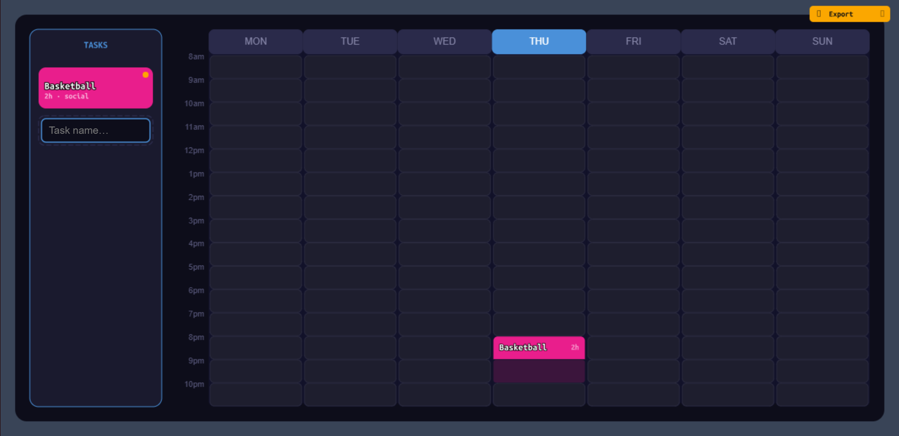

# 🗓️ Interactive Scheduling Board

A visual planning board built as a lightweight editor.

Drag, place, adjust — no forms, no friction.

---

## 🔗 Live Demo
interactive-scheduling-board-production.up.railway.app

---

## 💡 Concept

Most planning tools rely on forms, clicks, and structured input.

This project explores a different model:

→ **planning through direct manipulation**

You don’t “fill” schedules — you *shape* them.

---

## ⚡ Features

- Drag & drop tasks into a weekly grid  
- Time-based layout (Mon–Sun)  
- Scrollable task tray  
- Smooth, continuous interaction  
- Immediate visual feedback  

The board behaves like a small editor, not a CRUD app.

---

## 🧠 System

Built around a minimal interaction engine:

- State-driven rendering  
- Central input routing (`operator.js`)  
- Frame-based layout recalculation  
- Composable UI nodes (tray, grid, slots)  

No DOM layout dependency. Everything is drawn.

---

## 🛠 Tech

- JavaScript  
- p5.js (render loop)  
- Custom UI architecture  

No React. No UI frameworks.

---

## 🚧 Status

**V0 — Interactive Core**

Next:

- Context menus  
- Validation logic  
- Export (image / PDF)  
- Dataset / data layer page  

---

## ▶ Run

```bash
npm install
npm run dev