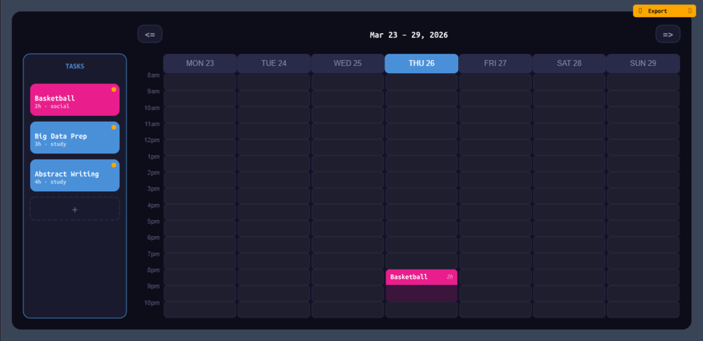

# 🗓️ Interactive Scheduling Board

A spatial scheduling interface built as a lightweight editor.

Drag, place, adjust — no forms, no friction.

---

## 🔗 Live Demo
https://interactive-scheduling-board-production.up.railway.app

---

## 💡 Concept

Most planning tools rely on forms, clicks, and structured input.

This project explores a different model:

→ **planning through direct manipulation**

Tasks are not filled — they are **placed in time**.

The schedule is shaped visually, like a board.

---

## ⚡ Interaction Model

- Tasks are **objects**, not entries  
- Time is represented as a **2D grid (day × hour)**  
- Scheduling becomes **positioning**, not editing  
- Interaction is **continuous**, not modal  

The board behaves like a small editor, not a CRUD interface.

---

## 🧠 System

Built as a minimal interaction engine:

- State-driven rendering loop  
- Central input routing (`operator.js`)  
- Frame-based layout computation  
- Composable UI nodes (tray, grid, slots)  

Everything is rendered manually — no DOM layout dependency.

---

## 🛠 Tech

- JavaScript  
- p5.js (render loop)  
- Custom UI architecture  

No React. No UI frameworks.

---

## 🚧 Status

**V0 — Interactive Core**

Next:

- Context menus  
- Validation logic  
- Export (image / PDF)  
- Dataset / data layer  

---

## ▶ Run

```bash
npm install
npm run dev